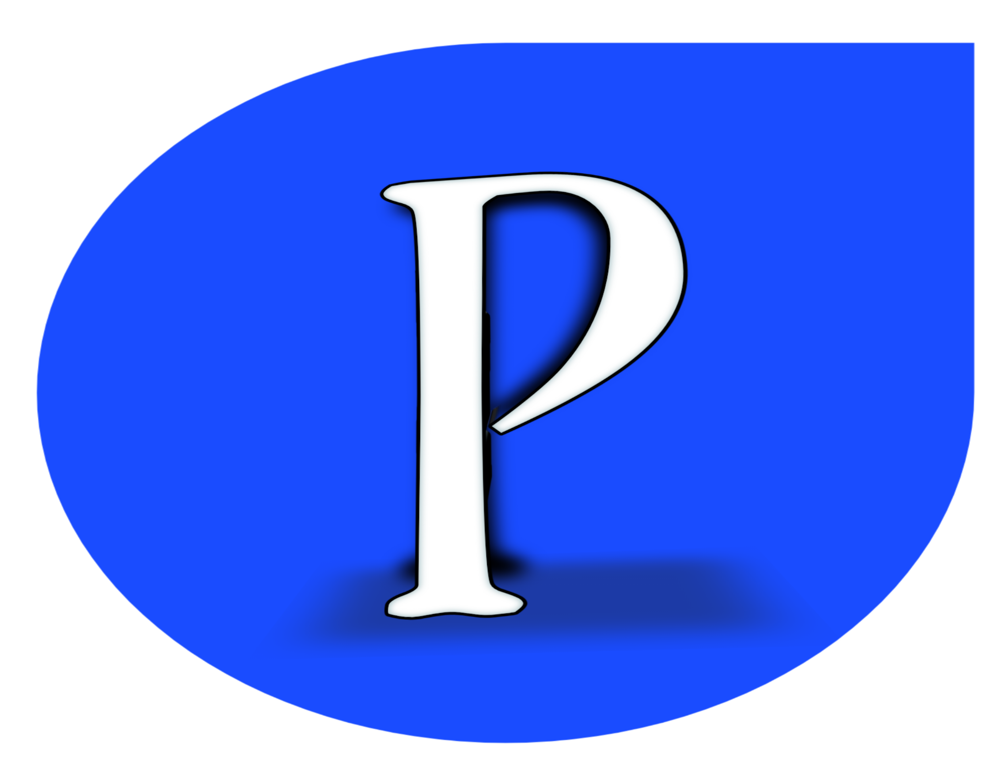
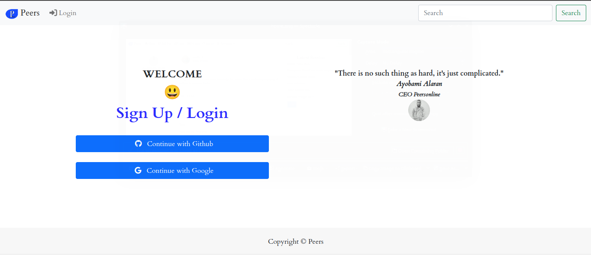
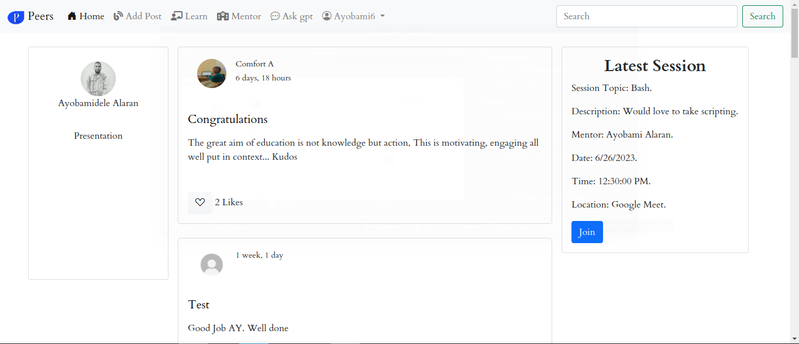

<div align="center">
  <!-- You are encouraged to replace this logo with your own! Otherwise you can also remove it. -->
  
  <br/>

  <h3><b>Peers</b></h3>

</div>


<a name="readme-top"></a>

<!-- TABLE OF CONTENTS -->

# 📗 Table of Contents

- [📖 About the Project](#about-project)
  - [🛠 Built With](#built-with)
    - [Tech Stack](#tech-stack)
    - [Key Features](#key-features)
  - [🚀 Live Demo](#live-demo)
- [💻 Getting Started](#getting-started)
  - [Prerequisites](#prerequisites)
  - [Setup](#setup)
  <!-- - [Install](#install)
  - [Usage](#usage) -->
  - [Run tests](#run-tests)
  <!-- - [Deployment](#deployment) -->
- [👥 Authors](#authors)
- [🔭 Future Features](#future-features)
- [🤝 Contributing](#contributing)
- [⭐️ Show your support](#support)
<!-- - [🙏 Acknowledgements](#acknowledgements)
- [❓ FAQ (OPTIONAL)](#faq) -->
- [📝 License](#license)

<!-- PROJECT DESCRIPTION -->

# 📖 Peers <a name="about-project"></a>

**Peers** is a website that helps Alx Students of software engineering learn better, faster and do hard stuffs easily with colleagues and peers of the same cohort and different cohorts

## 🛠 Built With <a name="built-with"></a>

### Tech Stack <a name="tech-stack"></a>

<details>
  <summary>Client</summary>
  <ul>
    <li><a href="https://jquery.com/">Jquery</a></li>
  </ul>
</details>

<details>
  <summary>Server</summary>
  <ul>
    <li><a href="https://www.djangoproject.com/">Django</a></li>
  </ul>
</details>

<details>
<summary>Database</summary>
  <ul>
    <li><a href="https://www.postgresql.org/">PostgreSQL</a></li>
  </ul>
</details>
<details>
  <summary>CI/Automation</summary>
  <ul>
    <li><a href="https://docs.github.com/en/actions/">Github Actions</a></li>
  </ul>
</details>
<details>
  <summary>Deployment</summary>
  <ul>
    <li><a href="https://www.nginx.com/">Nginx</a></li>
  </ul>
</details>

<!-- Features -->

### Key Features <a name="key-features"></a>

- **Learn**: This is a feature that allows student to learn with colleagues and peers on different tasks
- **Mentor**: This is a feature where peers can register to mentor others on a particular concept they want to talk about and teach, when a mentor register to mentor, all members of peers gets notified of the new mentor session.
- **Ask gpt**: This feature allows members of peers to ask chat gpt for advice on anything relating to software engineering alone, anything aside that gpt won't respond with what they expect.
- **Post**: This features allows members to post questions, articles, react to posts and comments
  and more.

<p align="right">(<a href="#readme-top">back to top</a>)</p>

<!-- LIVE DEMO -->

## 🚀 Live Demo <a name="live-demo"></a>

- [Demo](https://beta.peersonline.tech)

<p align="right">(<a href="#readme-top">back to top</a>)</p>

<!-- GETTING STARTED -->

## 💻 Getting Started <a name="getting-started"></a>

### Prerequisites

In order to run this project you need:

Atleast Python 3.6, Django 3.0.5, PostgreSQL 12.2

```sh
 sudo apt-get update && sudo apt-get install python3.6
```

## Setup <a name="setup"></a>


Steps

- Create a folder with name peers on your local machine

```bash
mkdir peers
cd peers
git clone <url> .
```

- Create virtual environment for linux and MacOX

```bash
python3 -m venv venv
```

- Activate venv

```bash
. venv/bin/activate
```

for Windows

```bash
> mkdir peers
> cd peers
> py -3 -m venv venv
```

Activate for Windows

```bash
venv\Scripts\activate
```

- Install all project dependecies

```sh
pip install -r requirements.txt
```

Change database settings in settings.py to your database settings

- Run migrations

```sh
./cmd.sh m
```

- Run Server

```sh
./cmd.sh run
```

Then open the generated port and host with your web browser with localhost/

Like this

```
http://127.0.0.1:8000/
```

If you encouter an issue setting up
create an Issue [here](https://github.com/Ayobami6/Peersonline/issues)

**Preview**




### Run tests

To run tests, run the following command:

```sh
  ./cmd.sh test
```

<!--
### Deployment

You can deploy this project using: -->

<!--
Example:

```sh

```
 -->

<p align="right">(<a href="#readme-top">back to top</a>)</p>

<!-- AUTHORS -->

## 👥 Authors <a name="authors"></a>

👤 **Ayobami Alaran**

- GitHub: [Ayobami6](https://github.com/Ayobami6)
- Twitter: [Ayobami Alaran](https://twitter.com/ayobamialaran)
- LinkedIn: [Ayobami Alaran](https://linkedin.com/in/ayobami-alaran)

<p align="right">(<a href="#readme-top">back to top</a>)</p>

<!-- FUTURE FEATURES -->

## 🔭 Future Features <a name="future-features"></a>

- [ ] **Search Posts**
- [ ] **Comment on Posts**

<p align="right">(<a href="#readme-top">back to top</a>)</p>

<!-- CONTRIBUTING -->

## 🤝 Contributing <a name="contributing"></a>

Contributions, issues, and feature requests are welcome!

Feel free to check the [issues page](https://github.com/Ayobami6/Peersonline/issues/).

<p align="right">(<a href="#readme-top">back to top</a>)</p>

<!-- SUPPORT -->

## ⭐️ Show your support <a name="support"></a>

If you like this project, help us by giving a ⭐️!

<p align="right">(<a href="#readme-top">back to top</a>)</p>

<!-- ACKNOWLEDGEMENTS -->

<!-- ## 🙏 Acknowledgments <a name="acknowledgements"></a>

> Give credit to everyone who inspired your codebase.

I would like to thank...

<p align="right">(<a href="#readme-top">back to top</a>)</p> -->

<!-- FAQ (optional) -->

<!-- ## ❓ FAQ (OPTIONAL) <a name="faq"></a>

> Add at least 2 questions new developers would ask when they decide to use your project.

- **[Question_1]**

  - [Answer_1]

- **[Question_2]**

  - [Answer_2]

<p align="right">(<a href="#readme-top">back to top</a>)</p> -->

<!-- LICENSE -->

## 📝 License <a name="license"></a>

This project is [MIT](./LICENSE) licensed.

<p align="right">(<a href="#readme-top">back to top</a>)</p>
